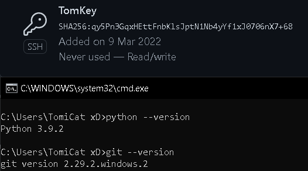
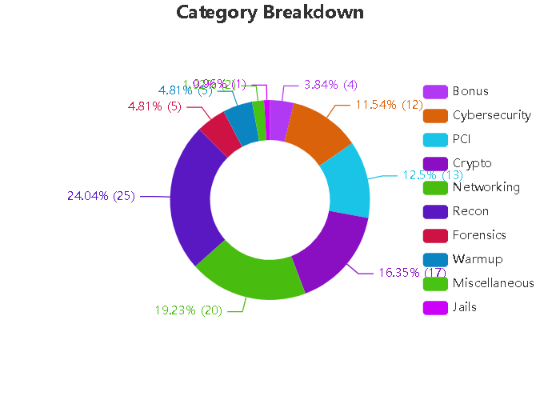
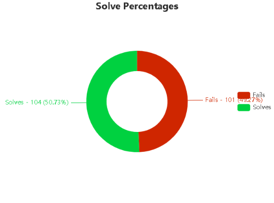
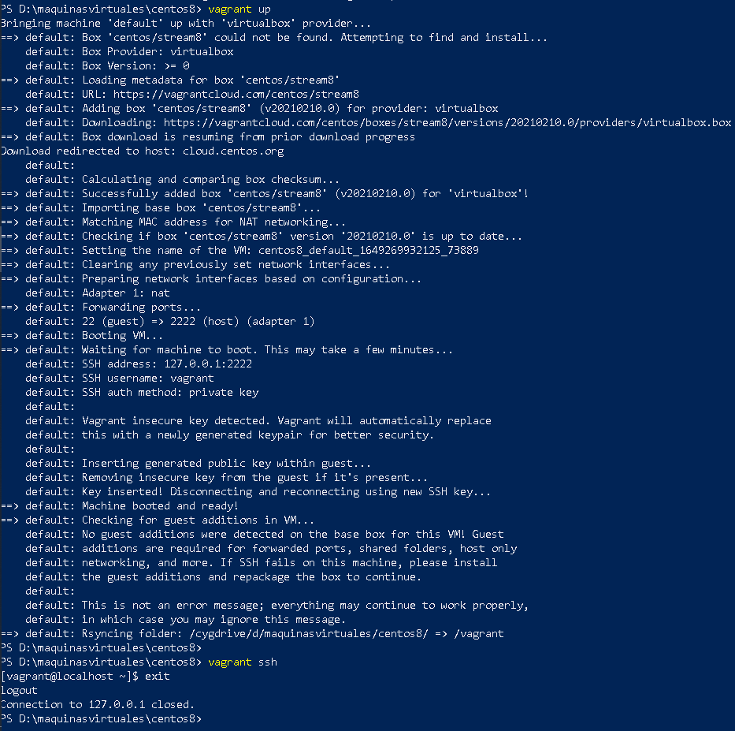
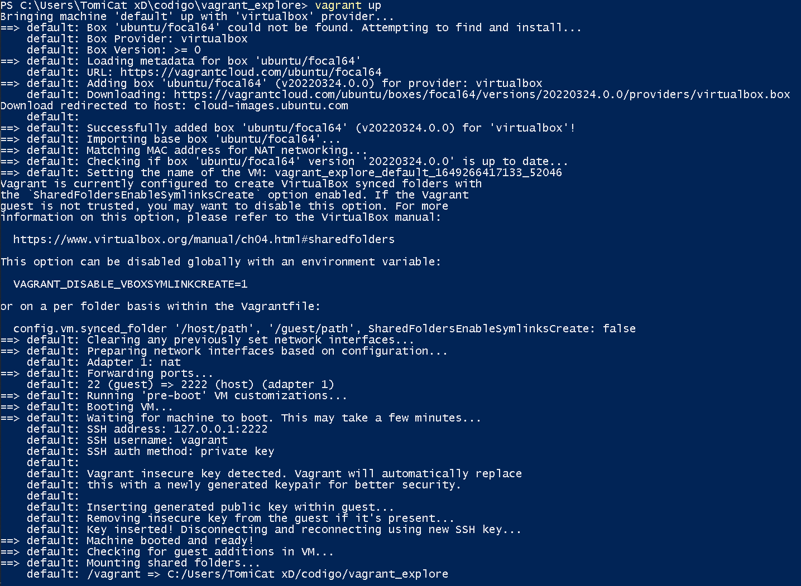
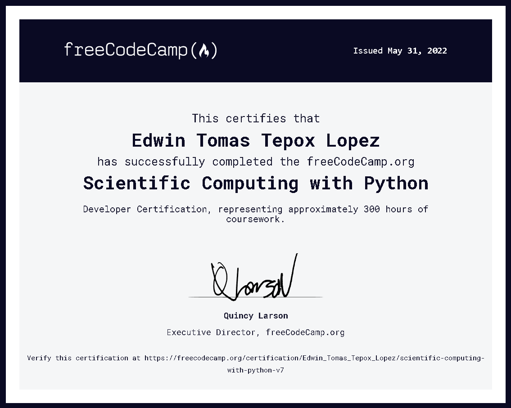

# TAREAS DEL SEMESTRE 🎓 

Bueno estas son todas las actividades hechas por [Edwin Tomas Tepox López](https://github.com/TomEd01)

<!--
## Tarea #998 instalación de git bash, python3, VSC, llave ssh

## Tarea #996 y #991 realización de 50 a 100 challenges

## Tarea #995 creación de un challengue
_Es lo que caracterisa en un objeto u elemento dentro del contexto del multiverso._

## Tarea #994 introducción a redes
Mi repositorio o mas bien el proyecto esta [aquí](https://github.com/TomEd01/Networking-Python)

## Tarea #992 instalacion de Centos y Ubuntu

## Tarea #990 creacion de proyecto con python
Mi primer con python esta juustamenmte [aqui](https://github.com/TomEd01/Python-Music-Player)

## Tarea #989 curso de 300hrs con python

-->
